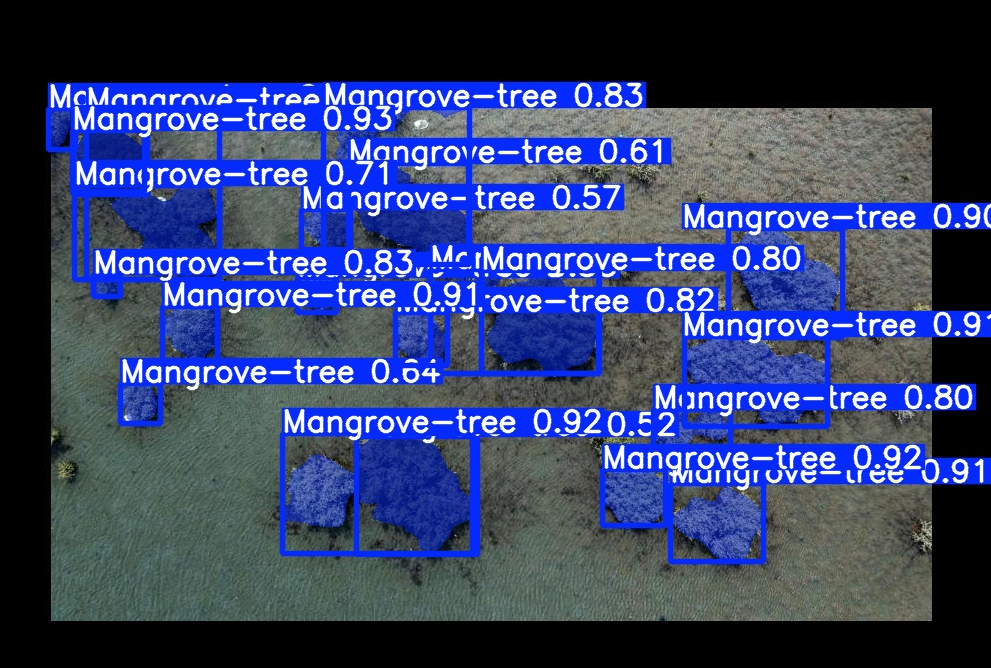
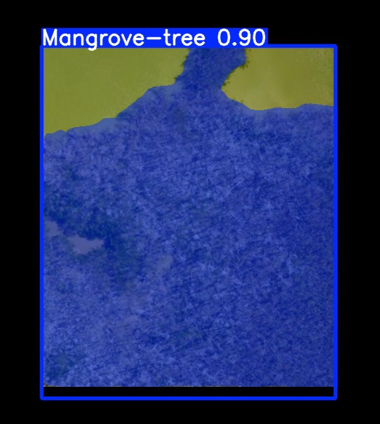
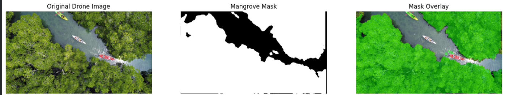
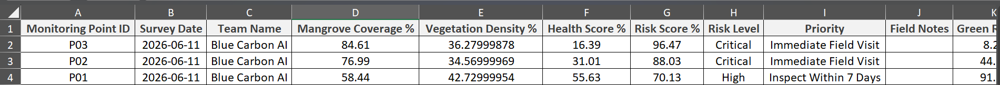

# Blue Carbon AI – Mangrove Monitoring Pipeline

## Overview

This repository contains a proof-of-concept AI pipeline developed for the Blue Carbon AI project.

The purpose of this prototype is to demonstrate the feasibility of using drone imagery and artificial intelligence to support mangrove monitoring, automate survey generation, and assist environmental teams in identifying high-priority monitoring locations.

This implementation is intended as a simulation of the proposed workflow and should not be considered the final production system.

---
## Dataset

The current prototype was trained using a small manually labeled mangrove dataset created for proof-of-concept validation.

Dataset Link:
[Dataset URL Here]

Note:
The current dataset is intended only to validate the proposed workflow. Future versions will be retrained using organization-specific datasets and operational monitoring data.

---

## Sample Results

### Mangrove Detection

Example output generated by the segmentation model:

### Segmentation Output

Original image, generated mask, and overlay visualization:

### Auto-Generated Monitoring Records

Example monitoring records generated automatically from analyzed images:

---

## Current Capabilities

The pipeline currently performs the following tasks:

1. Detect mangrove regions using an Instance Segmentation model.
2. Generate segmentation masks for detected mangrove areas.
3. Extract environmental indicators from each detected region.
4. Estimate vegetation coverage and density.
5. Calculate health-related indicators.
6. Generate monitoring records automatically.
7. Produce risk scores and priority levels for inspection.

---

## Data Sources

For demonstration purposes, some environmental variables are currently generated using predefined sample values.

Examples include:

* Temperature
* Humidity
* Salinity level
* Water level
* Rainfall

In the final system, these values will be collected automatically from:

* GPS coordinates attached to captured drone images.
* Weather and environmental APIs.
* GIS systems and spatial databases.
* Field monitoring records.

---

## Pipeline Modes

### 1. Single Image Analysis

The notebook includes a function that analyzes a single drone image.

Output:

* Segmentation mask
* Coverage indicators
* Density indicators
* Health indicators
* Risk assessment
* Automatically generated survey record

The generated record represents one monitoring point and can be stored individually.

---

### 2. Folder Analysis (Batch Processing)

The notebook also includes a batch-processing function.

This mode:

* Processes all images inside a selected folder.
* Analyzes each image independently.
* Generates one monitoring record per image.
* Stores all generated records inside a single Excel file.

In this workflow:

* Each image represents one monitoring point.
* Each monitoring point is stored as one row in the exported Excel sheet.

---

## Example Output

For each monitoring point, the system can generate indicators such as:

* Mangrove Coverage %
* Vegetation Density %
* Green Ratio %
* Brown/Dry Ratio %
* Health Score %
* Risk Score %
* Risk Level
* Priority Level
* Estimated Seedlings
* Estimated Healthy Seedlings
* Estimated Weak/Missing Seedlings

---

## Future Development

Planned improvements include:

* Training on organization-specific mangrove datasets.
* GPS integration for every captured image.
* Automatic weather and environmental data retrieval.
* GIS-based monitoring maps.
* Historical monitoring and trend analysis.
* AI Agent for survey completion, prioritization, reporting, and recommendations.
* Full web application integration.

---

## Disclaimer

This repository represents a prototype developed to validate the project concept and demonstrate the proposed AI workflow.

The segmentation model, extracted indicators, and generated monitoring records are intended for demonstration purposes and will be further refined using real operational datasets and field measurements.
